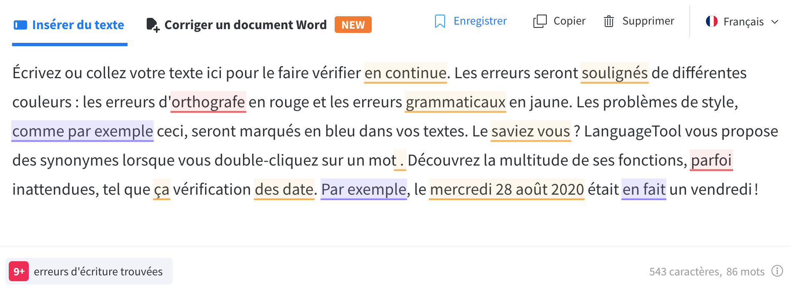
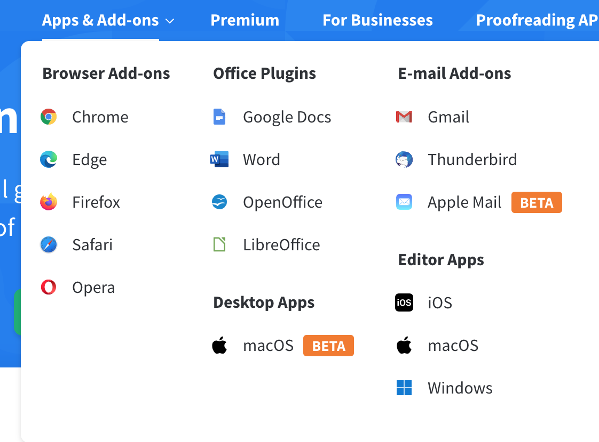
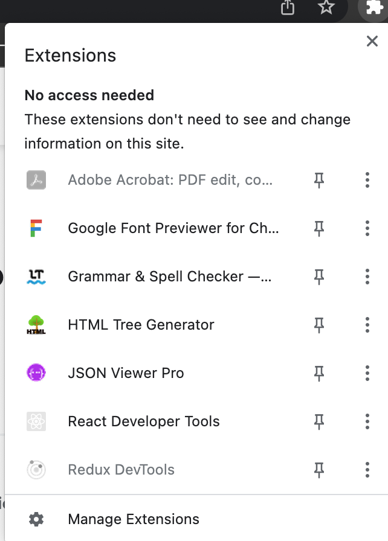
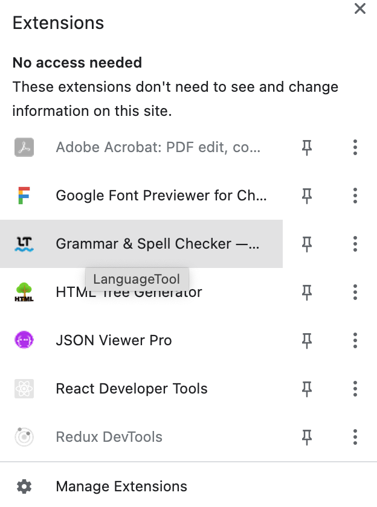
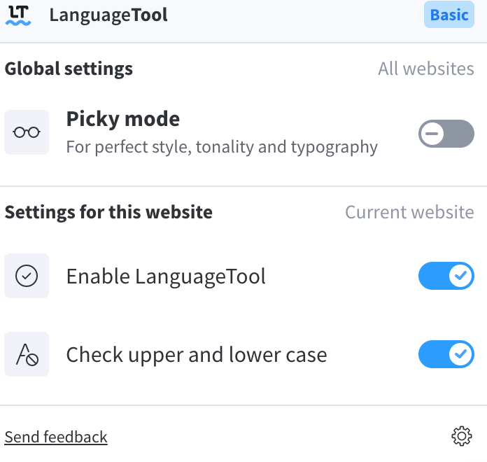
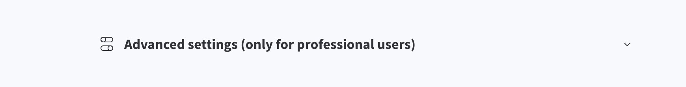
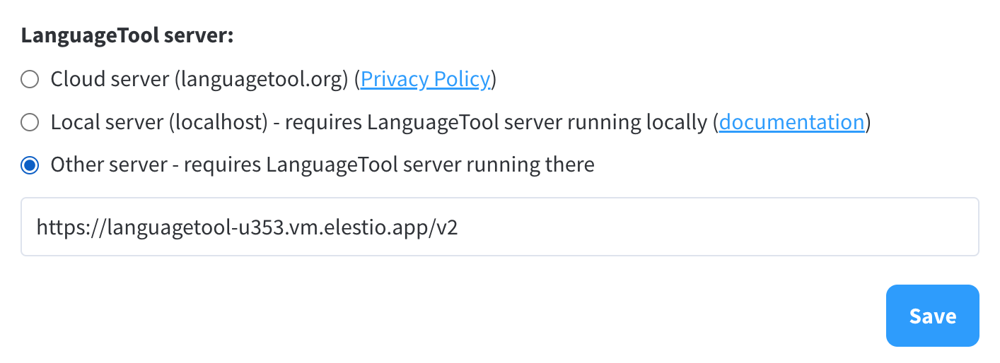
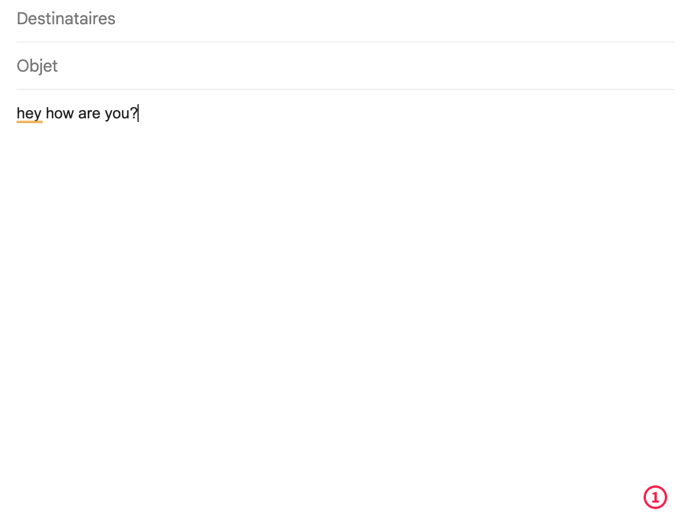
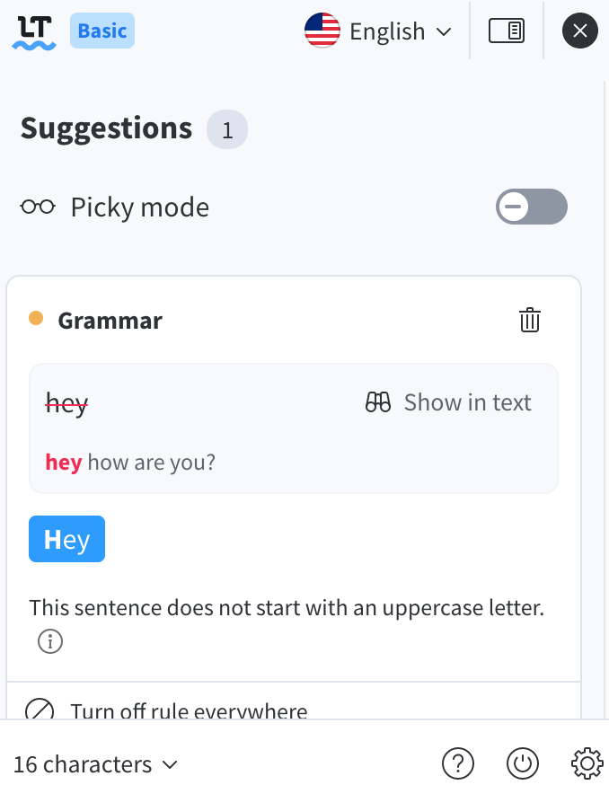

# LanguageTool CI/CD pipeline

Deploy LanguageTool server with CI/CD on Elestio

 
 

# API usage

Youy can now use LanguageTool REST API like this:

    curl -X POST --header 'Content-Type: application/x-www-form-urlencoded' --header 'Accept: application/json' -d 'text=hey%20whats%20up&language=auto&enabledOnly=false' 'https://[CI_CD_DOMAIN]/v2/check'

# Integrations and plugins

## Step 1.

Go to the <a target="_blank" href="https://languagetool.org/">LangagueTool website</a> and choose the app or Add-on of your choice.
In our case, we will choose Chrome

## Step 2.

In google chrome, go to the extensions tab and choose Grammar & Spell Checker.

## Step 3.

Click on the cog wheel at the bottom right of the tab

## Step 4.

Go to the very bottom of the page and choose Advanced settings

## Step 5.

In the drop-down menu choose the button Other server.
And type your server address.
For you, it will be:
https://[CI_CD_DOMAIN]/v2
Save

That's all. Now you can go in Gmail for example, and type a mail.
LanguageTool will do the job!

